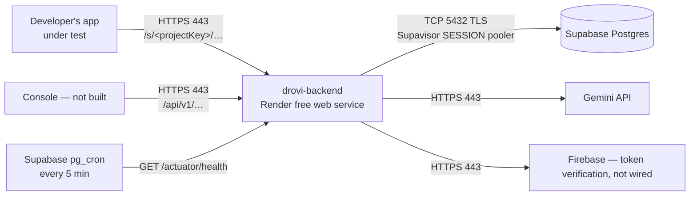

# Deployment

⚠️ **Nothing is deployed, and nothing can be.** `drovi-backend` `main` HEAD is still
`Initial commit`; the product exists only as an uncommitted working tree. Committing is
step zero for everything below.

## Topology

Two inbound paths, and the left one is the unusual part: **the caller is another
developer's application**, not a browser and not a person. That shapes several decisions —
cold starts read as timeouts, and the response shape must be the imitated product's, not
ours.

- **Only 443 is public.** `8080` is never exposed; Render terminates TLS.
- **No inbound webhook.** Nothing external calls Drovi except the sandboxes' own users.

## Environments

| Env | Where | Database | Deploy trigger |
| --- | --- | --- | --- |
| local | your machine | Supabase, or none — tests start their own | `./gradlew bootRun` |
| test | GitHub Actions runner | a real Postgres from a Gradle dependency | every push |
| prod | Render free web service | Supabase free, session pooler | push to `main` |

There is no staging. At this size a second Render service and a second Supabase project
would consume the free allowances that production depends on.

## How a deploy happens

1. Push to `main`.
2. Render builds the `Dockerfile` — the multi-stage build compiles the jar inside the
   image, so the builder image needs only a JDK new enough to run Gradle.
3. The container starts as a **non-root** user. Flyway applies pending migrations at
   startup.
4. `healthCheckPath: /actuator/health` gates the switchover.

The `Dockerfile` **is** the deploy path, not a portability hatch. Keeping deployment as a
Dockerfile rather than provider-specific config is what made three host changes cheap.

## Migrations and the no-blue/green rule

There is one instance, so during a deploy the new container starts while the old one is
still serving. A migration must therefore be **compatible with the previously running
version**: add columns before writing to them, never rename or drop in the same release
that stops using them.

INVARIANT: forward-only. Never roll back a migration; write a fix-forward one. Rolling the
*image* back is safe only if the older image tolerates the newer schema.

## Resource tuning

512 MB and 0.1 CPU is genuinely tight for a JVM. `JAVA_OPTS` caps the heap at 65% of the
container limit — `MaxRAMPercentage` reads the cgroup limit, so changing plan size needs no
rebuild — with `SerialGC` (below ~2 GB, G1's background threads cost more on 0.1 CPU than
its pauses save) and `TieredStopAtLevel=1` (skips C2: slower steady state, markedly faster
startup, which is the right trade when CPU is the scarce resource).

`DROVI_DB_POOL_MAX` is **2** in production. The Supabase free pooler is shared; a big pool
starves every other client of the project, including the SQL editor you would use to
diagnose it.

## Secrets

Every secret is entered once in the Render dashboard. `render.yaml` declares them with
`sync: false`, which means "prompt me, never store in git". No secret value appears in any
repo.

## Rollback

Render → the service → **Deploys** → redeploy a previous successful build. See
`runbook.md` for the schema caveat.
